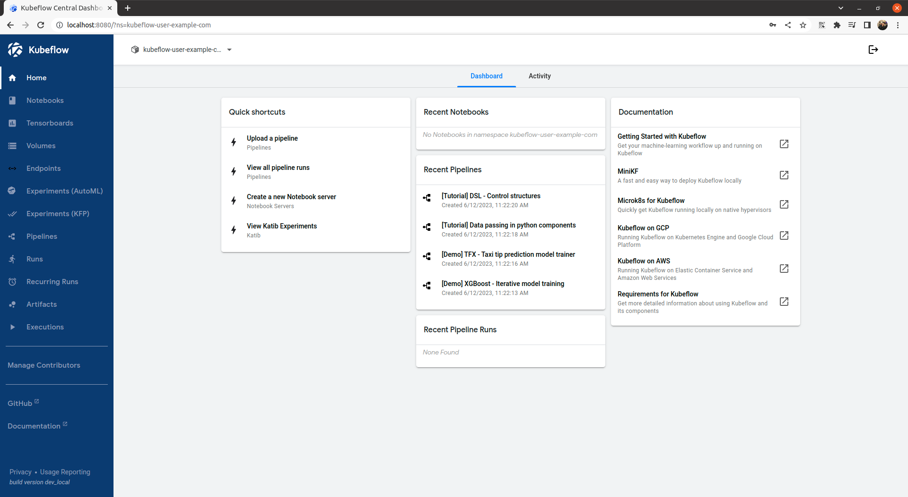

# Deploy Kubeflow on BareMetal Using Kustomize

[kubeflow/manifests Repository](https://github.com/kubeflow/manifests)

1. Cert-manager

``` bash
kustomize build common/cert-manager/cert-manager/base | kubectl apply -f -
```

2. kubeflow-issuer

``` bash
kustomize build common/cert-manager/kubeflow-issuer/base | kubectl apply -f -
```

3. Istio

CRD, namespace, Istio를 설치한다.

``` bash
kustomize build common/istio-1-16/istio-crds/base | kubectl apply -f -
kustomize build common/istio-1-16/istio-namespace/base | kubectl apply -f -
kustomize build common/istio-1-16/istio-install/base | kubectl apply -f -
```

4. Dex

``` bash
kustomize build common/dex/overlays/istio | kubectl apply -f -
```

5. OIDC AuthService

``` bash
kustomize build common/oidc-authservice/base | kubectl apply -f -
```

> **pvc 생성** 
> 
> [NFS 설치](https://github.com/ddung1203/TIL/blob/main/k8s/10_Volume.md#nfs%EB%A5%BC-%EC%82%AC%EC%9A%A9%ED%95%9C-%EC%A0%95%EC%A0%81-%ED%94%84%EB%A1%9C%EB%B9%84%EC%A0%80%EB%8B%9Dstatic-provision) 및 [NFS Dynamic Provisioner 구성](https://github.com/ddung1203/TIL/blob/main/k8s/10_Volume.md#nfs-dynamic-provisioner-%EA%B5%AC%EC%84%B1)을 참고
> 
> 또한, 기본 StorageClass nfs-client로 변경해준다.
> 
> `kubectl patch storageclass nfs-client -p '{"metadata": {"annotations":{"storageclass.kubernetes.io/is-default-class":"true"}}}'`

6. Kubeflow Namespace

``` bash
kustomize build common/kubeflow-namespace/base | kubectl apply -f -
```

7. Kubeflow Roles

``` bash
kustomize build common/kubeflow-roles/base | kubectl apply -f -
```

8. Kubeflow Istio Resources

``` bash
kustomize build common/istio-1-16/kubeflow-istio-resources/base | kubectl apply -f -
```

9. Kubeflow Pipelines

``` bash
kustomize build apps/pipeline/upstream/env/cert-manager/platform-agnostic-multi-user | awk '!/well-defined/' | kubectl apply -f -
```

10. Katib

``` bash
kustomize build apps/katib/upstream/installs/katib-with-kubeflow | kubectl apply -f -
```

11. Central Dashboard

``` bash
kustomize build apps/centraldashboard/upstream/overlays/kserve | kubectl apply -f -
```

12. Admission Webhook

``` bash
kustomize build apps/admission-webhook/upstream/overlays/cert-manager | kubectl apply -f -
```

13. Notebook & Jupyter Web App

``` bash
kustomize build apps/jupyter/notebook-controller/upstream/overlays/kubeflow | kubectl apply -f -

kustomize build apps/jupyter/jupyter-web-app/upstream/overlays/istio | kubectl apply -f -
```

14. Profiles + KFAM

``` bash
kustomize build apps/profiles/upstream/overlays/kubeflow | kubectl apply -f -
```

15. Volumes Web App

``` bash
kustomize build apps/volumes-web-app/upstream/overlays/istio | kubectl apply -f -
```

16. Tensorboard & Tensorboard Web App

``` bash
kustomize build apps/tensorboard/tensorboards-web-app/upstream/overlays/istio | kubectl apply -f -

kustomize build apps/tensorboard/tensorboard-controller/upstream/overlays/kubeflow | kubectl apply -f -
```

17. Trainging Operator

``` bash
kustomize build apps/training-operator/upstream/overlays/kubeflow | kubectl apply -f -
```

18. User Namespace

``` bash
kustomize build common/user-namespace/base | kubectl apply -f -
```

확인

``` bash
kubectl port-forward svc/istio-ingressgateway -n istio-system 8080:80
```



> ID: user@example.com
> 
> Password: 12341234

## MLflow Tracking Server

MLflow는 시험 관리 용도 외에 ML Model 패키징, 배포 관리, 모델 저장 기능을 제공한다.

1. MLflow Tracking Server 전, PostgreSQL DB 설치