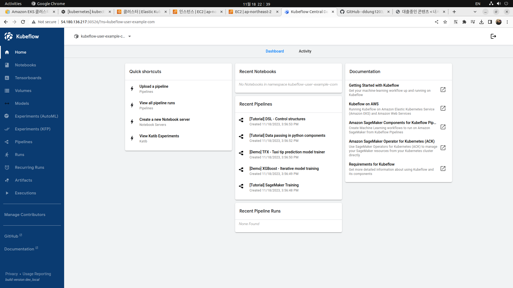
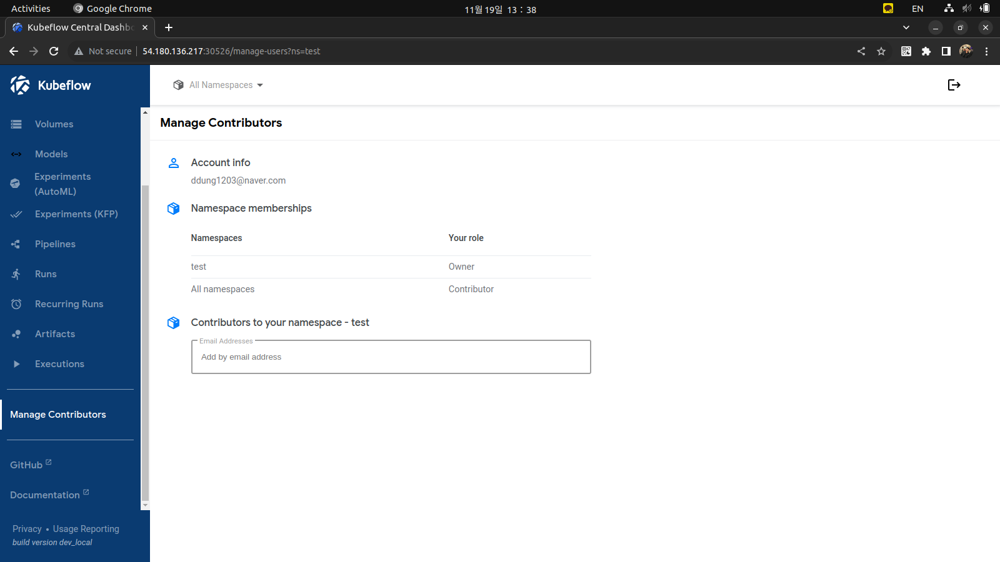

# Kubeflow Based on Amazon EKS

https://github.com/awslabs/kubeflow-manifests

https://github.com/kubeflow/manifests

## Prerequisites

### EKS Cluster

eksctl을 사용하여 EKS를 배포하는 방법은 [ddung1203 - DevOps.git](https://github.com/ddung1203/DevOps/blob/main/DevOps/AWS_EKS_%EB%B0%B0%ED%8F%AC.md)를 확인한다.

> Kubeflow를 설치 중 HPA를 위한 Metric Server와 EBS CSI Driver가 필수이다. 이 또한 [ddung1203 - DevOps.git](https://github.com/ddung1203/DevOps/blob/main/DevOps/AWS_EKS_%EB%B0%B0%ED%8F%AC.md)를 확인한다.

### Ubuntu Environment

자동화된 설치를 하기 위해선, Ubuntu 환경을 권장한다. EC2, VM 등을 사용할 수 있으며, Docker를 기준으로 기술하겠다.

Container 실행

```bash
docker container run -it -p 127.0.0.1:8080:8080 ubuntu:20.04
```

필수 패키지 설치

```bash
apt update
apt install git curl unzip tar make sudo vim wget -y
```

Git 레포 복제

```bash
export KUBEFLOW_RELEASE_VERSION=v1.7.0
export AWS_RELEASE_VERSION=v1.7.0-aws-b1.0.3
git clone https://github.com/awslabs/kubeflow-manifests.git && cd kubeflow-manifests
git checkout ${AWS_RELEASE_VERSION}
git clone --branch ${KUBEFLOW_RELEASE_VERSION} https://github.com/kubeflow/manifests.git upstream
```

필수 tools 설치

```bash
make install-tools

# NOTE: If you have other versions of python installed
# then make sure the default is set to python3.8
alias python=python3.8
```

AWS Configure 작성

```bash
aws configure --profile=kubeflow
# AWS Access Key ID [None]: <enter access key id>
# AWS Secret Access Key [None]: <enter secret access key>
# Default region name [None]: <AWS region>
# Default output format [None]: json

# Set the AWS_PROFILE variable with the profile above
export AWS_PROFILE=kubeflow
```

## Deploy the vanilla version of Kubeflow on AWS Using Kustomize

Kustomize를 사용하여 Kubeflow on AWS의 바닐라 버전 배포

```bash
make deploy-kubeflow INSTALLATION_OPTION=kustomize DEPLOYMENT_OPTION=vanilla
```

Delete의 경우, `Makefile` 내 확인 가능

```bash
make delete-kubeflow INSTALLATION_OPTION=kustomize DEPLOYMENT_OPTION=vanilla
```

짜잔!!



#### Profile 생성

Profile이란 프로파일과 같은 네임스페이스의 리소스 모음이다. 프로파일에 속한 사용자는 프로파일 내의 리소스를 조회/수정할 수 있는 권한을 가지게 된다. 물론, 프로파일에 속하지 않은 사용자는 해당 프로파일내의 리소스를 사용할 수 없다.

```bash
kubectl apply -f profile.yaml

kubectl get profile -A
NAME                        AGE
kubeflow-user-example-com   21h
test                        10s
```

`profile.yaml`

```yaml
apiVersion: kubeflow.org/v1beta1
kind: Profile
metadata:
  name: test
spec:
  owner:
    kind: User
    name: ddung1203@naver.com
  resourceQuotaSpec:
    hard:
      cpu: "6"
      memory: "16Gi"
      requests.nvidia.com/gpu: "1"
      persistentvolumeclaims: "10"
      requests.storage: "100Gi"
```

#### 사용자 추가/삭제

```bash
kubectl get configmap dex -n auth -o jsonpath='{.data.config\.yaml}' > dex-config.yaml
```

`static_password` 영역에 bcrypt로 해시된 텍스트를 작성하여 사용자를 추가/삭제 가능하다.

> bcrypt 해시
>
> ```bash
> docker run -it httpd:latest bash
>
> root@3a273021ad50:/usr/local/apache2# htpasswd -bnBC 10 "ddung1203@naver.com" password | cut -d ':' -f 2 | sed 's/2y/2a/'
> $2a$10$p7VgLu5txFQdauYI8K6uDeqPlbZ1HQUoB4ThznDxww.j6F8jsqQXq
> ```

`dex-config`

```yaml
- email: ddung1203@naver.com
  hash: $2y$12$4K/VkmDd1q1Orb3xAt82zu8gk7Ad6ReFR4LCP9UeYE90NLiN9Df72
  # https://github.com/dexidp/dex/pull/1601/commits
  # FIXME: Use hashFromEnv instead
  username: Joongseok
  userID: "15841185641784"
```

```bash
kubectl create configmap dex --from-file=config.yaml=dex-config.yaml -n auth --dry-run -o yaml | kubectl apply -f -
kubectl rollout restart deployment dex -n auth
```



상기와 같이 `test` 이름의 네임스페이스를 Own하는 것을 보여주며, Contributor를 이메일 주소로 추가할 수 있다.

또한 `resourceQuotaSpec`으로 제한된 리소스만을 사용할 수 있으며, 네임스페이스 별 분리된 리소스를 사용할 수 있다.

하기 `kubeflow-user-example-com`와 `test` 참고.

```bash
 jeonj@ubuntu > ~/eks > kubectl get ns
NAME                        STATUS   AGE
ack-system                  Active   21h
auth                        Active   21h
cert-manager                Active   21h
default                     Active   2d1h
istio-system                Active   21h
knative-eventing            Active   21h
knative-serving             Active   21h
kube-node-lease             Active   2d1h
kube-public                 Active   2d1h
kube-system                 Active   2d1h
kubeflow                    Active   21h
kubeflow-user-example-com   Active   21h
test                        Active   4m9s

 jeonj@ubuntu > ~/eks > kubectl get all -n test
NAME                                                  READY   STATUS    RESTARTS   AGE
pod/ml-pipeline-ui-artifact-67b5454fcb-cmdxf          2/2     Running   0          4m15s
pod/ml-pipeline-visualizationserver-9d8bfdc78-jc2kf   2/2     Running   0          4m15s

NAME                                      TYPE        CLUSTER-IP       EXTERNAL-IP   PORT(S)    AGE
service/ml-pipeline-ui-artifact           ClusterIP   172.20.252.252   <none>        80/TCP     4m16s
service/ml-pipeline-visualizationserver   ClusterIP   172.20.151.1     <none>        8888/TCP   4m16s

NAME                                              READY   UP-TO-DATE   AVAILABLE   AGE
deployment.apps/ml-pipeline-ui-artifact           1/1     1            1           4m16s
deployment.apps/ml-pipeline-visualizationserver   1/1     1            1           4m16s

NAME                                                        DESIRED   CURRENT   READY   AGE
replicaset.apps/ml-pipeline-ui-artifact-67b5454fcb          1         1         1       4m16s
replicaset.apps/ml-pipeline-visualizationserver-9d8bfdc78   1         1         1       4m16s
```

---

#### ⚠️ 경고

현재 버전 기준, HPA의 `autoscaling/v2beta2`은 deprecated 되었다. 하지만 `awslabs` 기준의 버전과 이에 상응하는 `kubeflow` 버전은 deprecated된 `autoscaling/v2beta2`를 사용하고 있다.

따라서 `autoscaling/v2beta2`를 `autoscaling/v2`로 수정해주도록 한다.

> 리눅스 파일 내부 문자열 검색
>
> ```bash
> grep -r autoscaling/v2beta2 .
> ```

#### ⚠️ EKS Worker node Pod 한도

Worker Node에는 인스턴스 타입별로 최대 Pod 개수가 정해져 있다. EKS의 기능상 제약사항이 아닌 EC2의 ENI의 개수 및 ENI 별로 할당 가능한 IP 주소의 개수에서 나온다.

최대치를 넘는 Pod를 배포하려 한다면, ENI에 IP 할당에 실패하여 `Pending` 상태로 기다리게 되며 `kubectl describe` 시 `too many pods`로 에러 메시지를 확인할 수 있다.

해결 방법으로는, 인스턴스 타입을 높게 변경하거나 인스턴스를 추가한다.

그러나 AWS에서 IP prefixes기능을 사용해 기존 제한보다 더 많은 팟을 생성할 수 있으며, 개별 아이피 주소를 할당하는 대신 ip prefix를 활용해 기존의 할당가능한 아이피의 개수에 약 16배를 늘려준다.

Amazon EKS 사용 설명서 참고 - [Amazon EC2 노드에 사용 가능한 IP 주소 증량](https://docs.aws.amazon.com/ko_kr/eks/latest/userguide/cni-increase-ip-addresses.html)

> **Kustomize**: Kubernetes의 배포 도구
>
> Kustomize는 기존에 사용되던 YAML을 그대로 사용하며, kustomization.yaml과 base, overlay 및 production, dev 등 디렉토리를 환경에 맞게 구성하여 별도의 데이터 기반으로 배포 관리를 할 수 있다.
>
> Kustomize와 Helm의 차이점
>
> - Kustomize는 기존 YAML을 그대로 사용하며, 디렉토리를 활용하여 배포 관리를 하는 반면, Helm은 차트를 사용하여 패키지 관리를 합니다.
> - Kustomize는 kubectl v1.14에 통합되었으며, Helm은 Kubernetes 패키지 관리 도구로서 독립적으로 사용된다.
> - Kustomize는 기본적으로 사용되던 YAML을 그대로 사용하며, Helm은 Chart를 사용하여 패키지 관리를 한다.
