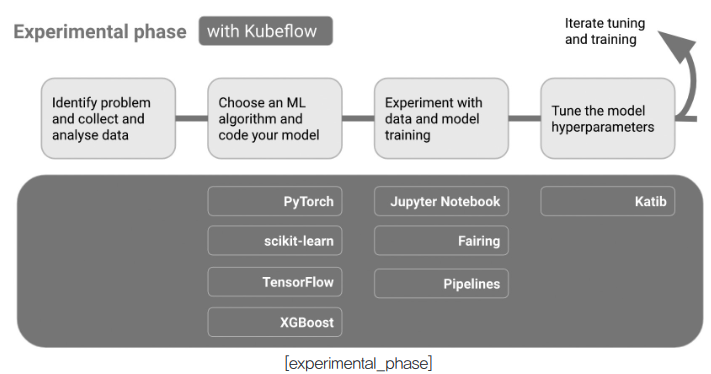
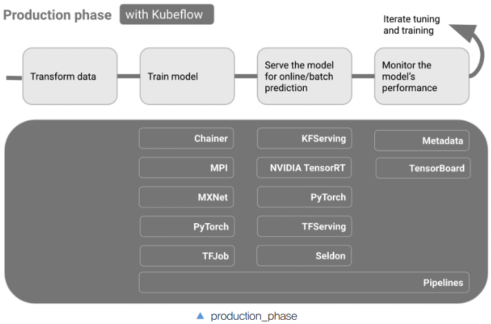
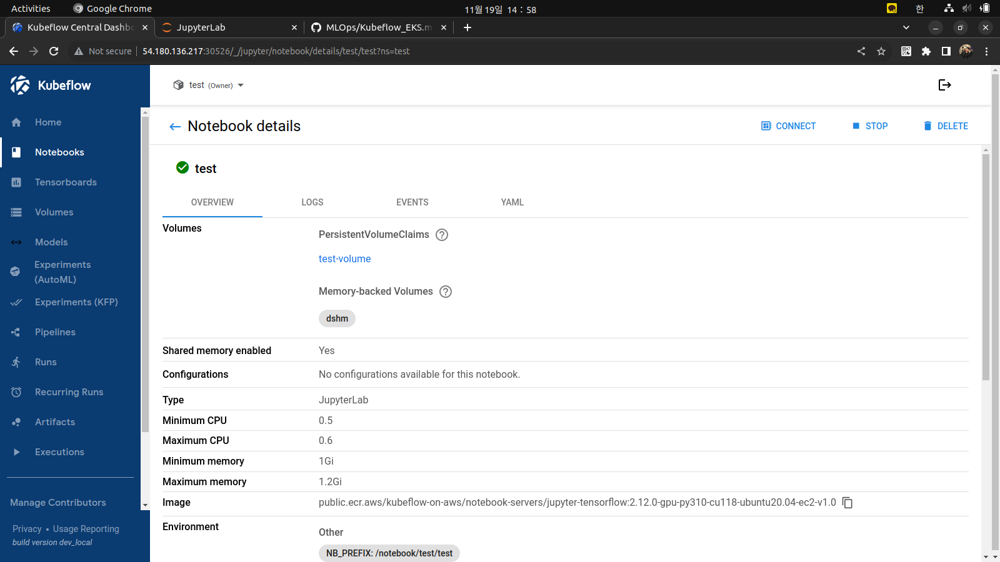
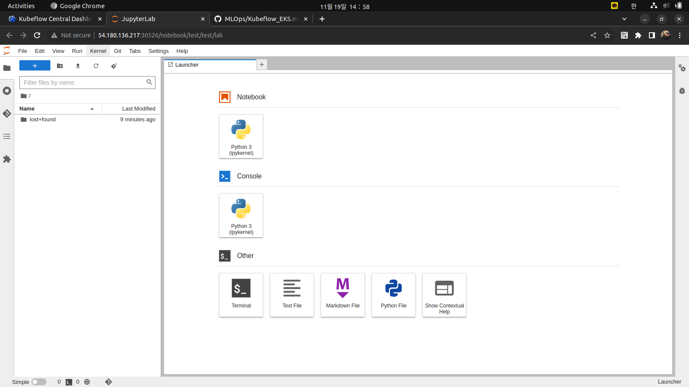
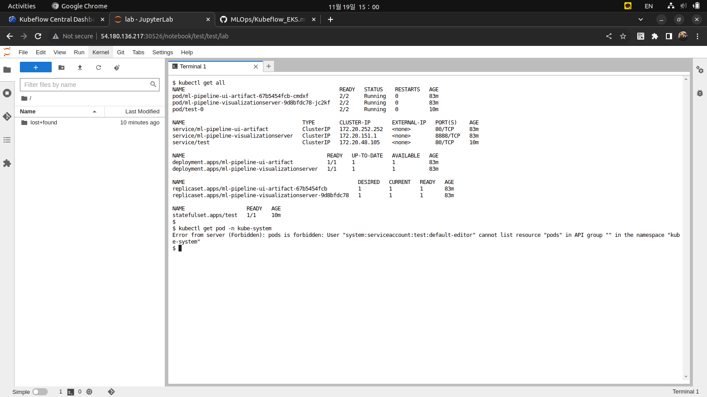
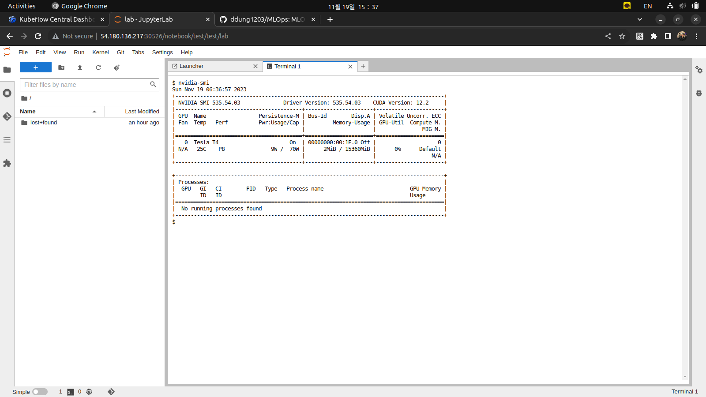
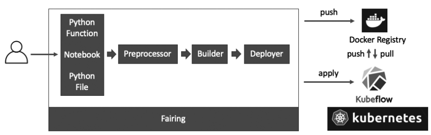
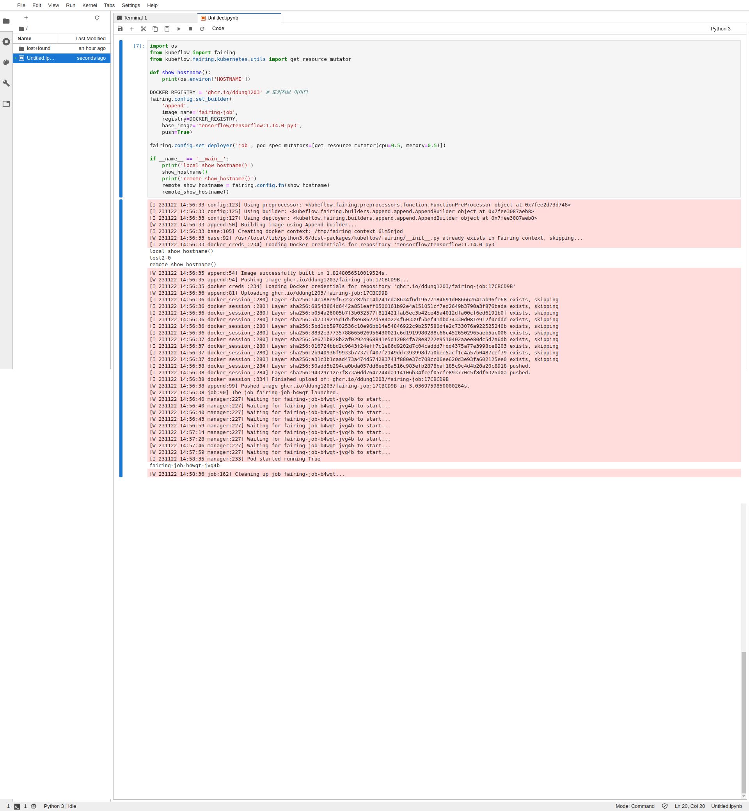

# MLOps

현재 진행하는 실습은 EKS 환경에서 진행하였으며, `Deploy the vanilla version of Kubeflow on AWS Using Kustomize`를 사용하여 Kubeflow를 배포하였다. 자세한 배포 방법은 [다음](./Kubeflow_EKS.md)을 클릭한다.

목차

- [Practitioners guide to MLOps](./mlops-component.md)
- [Deploy Kubernetes with GPU enabled](./setup_kubernetes.md)
- [Deploy Kubeflow on BareMetal Using Kustomize](./Kubeflow_BareMetal.md)
- [Deploy the vanilla version of Kubeflow on AWS Using Kustomize](./Kubeflow_EKS.md)

## Kubeflow

Kubeflow는 Kubernetes 용 기계 학습 툴킷이다. ML 워크플로우에 필요한 서비스를 만드는 것이 아닌, 각 영역에서 가장 적합한 오픈 소스 시스템들을 제공하는 것이다.

ML Workflow

1. 데이터 준비
2. 모델 교육
3. 예측 제공
4. 서비스 관리

Kubeflow는 Kubernetes가 하기의 기능을 수행하도록 하여 ML모델을 확장하고 Production에 배포하는 작업을 간단하게 한다.

- 다양한 인프라에서 쉽고 반복 가능하며 이식 가능한 배포
- 느슨하게 결합된 마이크로서비스 배포 및 관리
- 수요에 따른 확장

#### 컴포넌트





- 쥬피터 노트북
- 메인 대시보드
- 하이퍼파라미터 튜닝
- 파이프라인
- 서빙
- 학습
- etc

### Jupyter Notebook Server

Jupyter Notebook Server는 K8s 위에서 실행되는 쥬피터 노트북 서버이다. K8s에서 리소스를 스케쥴링하기 때문에 간단히 노트북을 할당받을 수 있다.

생성 시 이미지와 리소스, 워크스페이스의 불륨과 데이터 볼륨를 선택한다. 이로 인해 PV와 `test` 네임스페이스 내 Pod가 생성됨을 확인할 수 있다.



Connect 버튼을 눌러서 하기와 같이 노트북에 접속할 수 있다.





상기 이미지와 같이, 노트북 생성시 해당 Kubeflow 및 namespace의 리소스를 사용할 수 있는 권한을 바인딩하기 때문에 노트북 상에서도 `kubectl`을 통해 k8s의 리소스를 관리할 수 있다. 물론 권한이 없는 다른 네임스페이스의 리소스를 확인할 수는 없다.

추가로, GPU를 사용을 활성화 시 하기와 같이 요청하게 된다.

`test-0`의 Pod

```yaml
spec:
  containers:
    - env:
      resources:
        limits:
          cpu: 600m
          memory: 1288490188800m
          nvidia.com/gpu: "1"
        requests:
          cpu: 500m
          memory: 1Gi
          nvidia.com/gpu: "1"
```

`kubectl describe nodes`

```bash
Allocated resources:
  (Total limits may be over 100 percent, i.e., overcommitted.)
  Resource           Requests      Limits
  --------           --------      ------
  cpu                1200m (30%)   14700m (375%)
  memory             1814Mi (12%)  11287710924800m (71%)
  ephemeral-storage  0 (0%)        0 (0%)
  hugepages-1Gi      0 (0%)        0 (0%)
  hugepages-2Mi      0 (0%)        0 (0%)
  nvidia.com/gpu     1             1
```

따라서 Jupyter notebook에서 GPU를 사용하고자 한다면, 그래픽 인스턴스에 자동으로 할당이 되며, 하기와 같이 GPU가 사용 가능함을 확인할 수 있다.



#### 커스텀 이미지 생성

Jupyter Notebook이 실행되는 이미지를 커스텀하여 생성할 수 있다. 하기 Dockerfile을 빌드 후 registry에 배포한다. 이후 Custom Image 항목 내 적용하여 사용한다.

```Dockerfile
FROM python:3.6

WORKDIR /home/jovyan

USER root

RUN pip install jupyter -U && pip install jupyterlab

RUN apt-get update && apt-get install -yq --no-install-recommends \
  apt-transport-https \
  build-essential \
  bzip2 \
  ca-certificates \
  curl \
  g++ \
  git \
  gnupg \
  graphviz \
  locales \
  lsb-release \
  openssh-client \
  sudo \
  unzip \
  vim \
  wget \
  zip \
  emacs \
  python3-pip \
  python3-dev \
  python3-setuptools \
  && apt-get clean && \
  rm -rf /var/lib/apt/lists/*


RUN curl -s https://packages.cloud.google.com/apt/doc/apt-key.gpg | sudo apt-key add -
RUN echo "deb https://apt.kubernetes.io/ kubernetes-xenial main" | sudo tee -a /etc/apt/sources.list.d/kubernetes.list
RUN apt-get update
RUN apt-get install -y kubectl

RUN pip install jupyterlab && \
    jupyter serverextension enable --py jupyterlab --sys-prefix

RUN pip install kubernetes kubeflow kfp redis
RUN pip install kubeflow-katib==0.0.2
RUN pip install kubeflow-fairing

ARG NB_USER=jovyan

EXPOSE 8888


ENV NB_USER $NB_USER
ENV NB_UID=1000
ENV HOME /home/$NB_USER
ENV NB_PREFIX /

CMD ["sh", "-c", "jupyter lab --notebook-dir=/home/jovyan --ip=0.0.0.0 --no-browser --allow-root --port=8888 --LabApp.token='' --LabApp.password='' --LabApp.allow_origin='*' --LabApp.base_url=${NB_PREFIX}"]
```

**⚠️ Could not find CSRF cookie XSRF-TOKEN in the request.**

HTTPS가 아닌 HTTP를 통해 Kubeflow UI에 액세스하기에 옵션 변경을 해주어야 한다.

```bash
kubectl edit deployment jupyter-web-app-deployment -n kubeflow
```

```yaml
spec:
  containers:
    - env:
        - name: APP_SECURE_COOKIES
          value: "false"
```

```bash
kubectl rollout restart deployment jupyter-web-app-deployment -n kubeflow
```

### Fairing

Fairing은 Kubeflow가 설치된 환경에서 ML 모델을 학습/배포할 수 있는 Python 패키지이다. PyCharm에서도 Kubeflow의 Jupyter Notebook에서도 ML 모델의 생성, 학습, 배포 등의 작업을 k8s 클러스터로 요청이 가능하다.

- 쉬운 ML 모델 트레이닝 잡 패키지(작성한 모델 코드를 Dockerization)
- 쉬운 학습
- 쉬운 배포

#### 아키텍처

페어링은 Jupyter Notebook, Python 함수, Python 파일을 Docker 이미지로 빌드 후 레지스트리에 푸시한다. 푸시가 완료되면 설정한 배포 리소스 타입에 따라 k8s Job, TFJob, KFServing 등의 리소스로 변환하여 k8s API 서버로 요청한다. 이 과정은 하기와 같이 실행한다.

- preprocessor: 작성된 코드를 Docker 이미지에 넣을 수 있도록 패키지화
- builder: 패키지된 파일을 Docker 이미지화
- deployer: 생성된 이미지를 k8s 클러스터에 배포



#### 설치

생성한 Jupyter Notebook의 Terminal에서 실행한다.

```bash
pip install kubeflow-fairing
```

#### 설정

페어링은 Docker 이미지와 k8s 리소스를 사용하는 패키지이기 때문에 Docker 레지스트리 정보와 Kubeflow 클러스터에 접속할 수 있는 권한이 필요하다.

따라서, Jupyter Notebook 내에 Terminal 접속 후 `/home/jovyan/.docker/config.json`을 작성하여 Docker 이미지를 푸시 및 풀 설정을 해주도록 하며, k8s에서 Docker 이미지를 사용하기 위해선 [이곳](https://github.com/ddung1203/DevOps/blob/main/DevOps/imagePullSecrets.md#pod%EC%97%90%EC%84%9C-imagepullsecrets-%EC%84%A4%EC%A0%95)을 참고한다.

> `default-editor`의 Service Account를 편집


#### fairing.config

페어링을 코드에 적용할 때, 코드를 건드리지 않고 fairing.config로 시작하는 코드만 넣어주면 페어링이 적용된다.

```py
import os
from kubeflow import fairing
from kubeflow.fairing.kubernetes.utils import get_resource_mutator

def show_hostname():
    print(os.environ['HOSTNAME'])

DOCKER_REGISTRY = 'ghcr.io/ddung1203'
fairing.config.set_builder(
    'append',
    image_name='fairing-job',
    registry=DOCKER_REGISTRY,
    base_image='tensorflow/tensorflow:1.14.0-py3',
    push=True)

fairing.config.set_deployer('job', pod_spec_mutators=[get_resource_mutator(cpu=0.5, memory=0.5)])

if __name__ == '__main__':
    print('local show_hostname()')
    show_hostname()
    print('remote show_hostname()')
    remote_show_hostname = fairing.config.fn(show_hostname)
    remote_show_hostname()
```

상기 예제는 `HOSTNAME` 환경변수를 출력하는 함수를 k8s의 Job으로 실행하는 소스이다.

실행이 되면 `tensorflow/tensorflow:1.14.0-py3`를 베이스 이미지를 삼고 `train()` 함수를 실행하는 Docker 이미지를 생성한다.

이후 `ghcr.io/ddung1203:fairing-job` 레지스트리에 푸시 후 완료되면 k8s Job이 실행된다.



