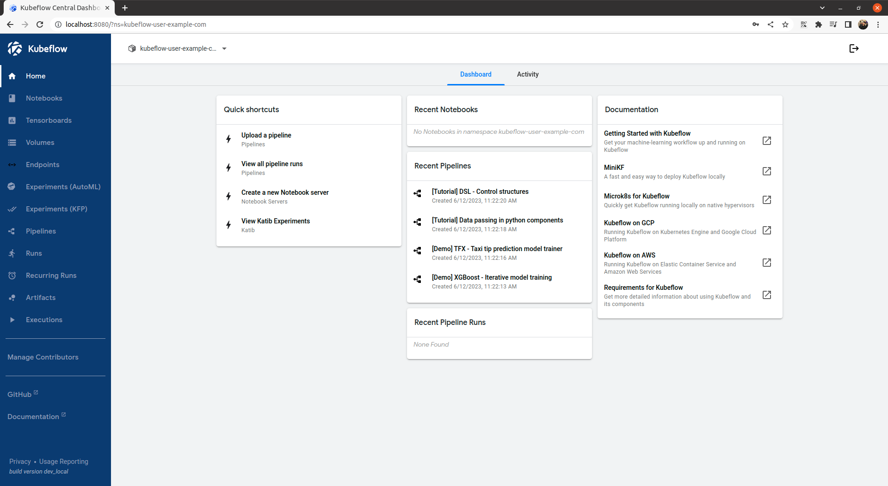

# MLOps

[Practitioners guide to MLOps](mlops-component.md)

MLOps는 Machine Learning Operations을 뜻하며, MLOps는 머신 러닝 모델을 productio으로 전환하는 프로세스를 간소화하고, 뒤이어 이를 유지관리하고 모니터링하는 데 주안점을 둔 기능이다. 이를 위해 ML 모델의 적절한 모니터링, 검증과 거버넌스를 포함해 지속적인 통합과 배포를 구현해야 한다.

## Setup Kubernetes

### 1. Install Docker

[Install Docker](https://github.com/ddung1203/TIL/blob/main/Docker/00_Docker_intro.md#docker-engine-%EC%84%A4%EC%B9%98)

### 2. Turn off Swap Memory

Swap 메모리의 경우 물리직으로 사용할 수 있는 메모리가 부족할 경우 일부를 디스크에 저장해놓고 메모리 블럭이 자리가 나면 다시 이동시키는 방법으로 데이터의 저장 위치를 교환한다. 만약 16Gi 램으로 17Gi 메모리가 필요한 연산을 진행할 수 있다.

그러나 Kubernetes에서 Swap Memory를 사용하게 되면 컨테이너의 속도가 변동적이게 된다. 왜냐하면 Swap Memory를 어떤 컨테이너가 쓰면서 느려지는지 예측할 수 없기 때문이다.

``` bash
sudo swapoff -a
```

### 3. Install Kubernetes - Kubeadm

``` bash
sudo apt-get update
sudo apt-get install -y apt-transport-https ca-certificates curl

curl -fsSL https://packages.cloud.google.com/apt/doc/apt-key.gpg | sudo gpg --dearmor -o /etc/apt/keyrings/kubernetes-archive-keyring.gpg

echo "deb [signed-by=/etc/apt/keyrings/kubernetes-archive-keyring.gpg] https://apt.kubernetes.io/ kubernetes-xenial main" | sudo tee /etc/apt/sources.list.d/kubernetes.list

sudo apt-get update
sudo apt-get install -y kubelet kubeadm kubectl
sudo apt-mark hold kubelet kubeadm kubectl
```

> [cgroup driver 오류](https://github.com/ddung1203/TIL/blob/main/k8s/00_Kubeadm_k8s_install.md#cgroup-driver-%EC%98%A4%EB%A5%98)
> 
> 컨테이너 런타임과 kubelet의 cgroup 드라이버를 일치시켜야 하며, 그렇지 않은 경우 kubelet 프로세스에 오류가 발생한다. 상기의 링크를 참고하여 수정을 한다.

> [systemd cgroup 드라이브 환경 설정](https://kubernetes.io/ko/docs/setup/production-environment/container-runtimes/#containerd-systemd)
> 
> 만약 containerd를 패키지(RPM, .deb 등)를 통해 설치하였다면, CRI integration 플러그인은 기본적으로 비활성화되어 있다.
> 
> 쿠버네티스에서 containerd를 사용하기 위해서는 CRI support가 활성화되어 있어야 한다. cri가 /etc/containerd/config.toml 파일 안에 있는 disabled_plugins 목록에 포함되지 않도록 주의하자. 만약 해당 파일을 변경하였다면, containerd를 다시 시작한다.


### 4. Setup GPU

1. Install NVIDIA Driver

``` bash
sudo add-apt-repository ppa:graphics-drivers/ppa
sudo apt update && sudo apt install -y ubuntu-drivers-common
sudo ubuntu-drivers autoinstall
sudo reboot
```

2. Install NVIDIA-Docker

``` bash
curl -s -L https://nvidia.github.io/nvidia-docker/gpgkey | \
  sudo apt-key add -
distribution=$(. /etc/os-release;echo $ID$VERSION_ID)
curl -s -L https://nvidia.github.io/nvidia-docker/$distribution/nvidia-docker.list | sudo tee /etc/apt/sources.list.d/nvidia-docker.list
sudo apt-get update
sudo apt-get install -y nvidia-docker2 &&
sudo systemctl restart docker
```

검증

``` bash
ubuntu@desktop > ~/git/MLOps > sudo docker run --rm --gpus all nvidia/cuda:12.1.1-base-ubuntu20.04 nvidia-smi
[sudo] password for ubuntu: 
Sun Jun 11 15:42:10 2023       
+---------------------------------------------------------------------------------------+
| NVIDIA-SMI 530.41.03              Driver Version: 530.41.03    CUDA Version: 12.1     |
|-----------------------------------------+----------------------+----------------------+
| GPU  Name                  Persistence-M| Bus-Id        Disp.A | Volatile Uncorr. ECC |
| Fan  Temp  Perf            Pwr:Usage/Cap|         Memory-Usage | GPU-Util  Compute M. |
|                                         |                      |               MIG M. |
|=========================================+======================+======================|
|   0  NVIDIA GeForce GTX 960          Off| 00000000:01:00.0  On |                  N/A |
|  5%   44C    P0               29W / 130W|    688MiB /  2048MiB |      3%      Default |
|                                         |                      |                  N/A |
+-----------------------------------------+----------------------+----------------------+
                                                                                         
+---------------------------------------------------------------------------------------+
| Processes:                                                                            |
|  GPU   GI   CI        PID   Type   Process name                            GPU Memory |
|        ID   ID                                                             Usage      |
|=======================================================================================|
+---------------------------------------------------------------------------------------+
```

3. NVIDIA-Docker - Default Container Runtime 설정

`/etc/docker/daemon.json`

``` json
{
  "default-runtime": "nvidia",
  "runtimes": {
      "nvidia": {
          "path": "nvidia-container-runtime",
          "runtimeArgs": []
  }
  }
}
```

``` bash
sudo systemctl daemon-reload
sudo service docker restart
```

검증

``` bash
ubuntu@desktop > ~/git/MLOps > sudo docker info | grep nvidia
 Runtimes: io.containerd.runc.v2 nvidia runc
 Default Runtime: nvidia
```

4. NVIDIA Device Plugin

[containerd 구성](https://github.com/NVIDIA/k8s-device-plugin#configure-containerd)

Kubernetes로 실행할 때 low-level 런타임으로 설정하기 위해 하기와 같이 설정한다.

`/etc/containerd/config.toml`
``` toml
version = 2
[plugins]
  [plugins."io.containerd.grpc.v1.cri"]
    [plugins."io.containerd.grpc.v1.cri".containerd]
      default_runtime_name = "nvidia"

      [plugins."io.containerd.grpc.v1.cri".containerd.runtimes]
        [plugins."io.containerd.grpc.v1.cri".containerd.runtimes.nvidia]
          privileged_without_host_devices = false
          runtime_engine = ""
          runtime_root = ""
          runtime_type = "io.containerd.runc.v2"
          [plugins."io.containerd.grpc.v1.cri".containerd.runtimes.nvidia.options]
            BinaryName = "/usr/bin/nvidia-container-runtime"
```

``` bash
sudo systemctl restart containerd
```

Kubernets의 버전에 맞게 plugin을 설치한다.

[NVIDIA/k8s-device-plugin](https://github.com/NVIDIA/k8s-device-plugin)

``` bash
wget https://raw.githubusercontent.com/NVIDIA/k8s-device-plugin/v0.14.0/nvidia-device-plugin.yml
```

현재 환경은 Control Plane에서 모든 것을 실행중이다. 하기의 설정은 Control Plane 노드에 Pod를 배포하기 위해선 Toleration을 통해 Taint가 있는 Pod를 스케줄링할 수 있도록 한다.

[Taint & Toleration](https://github.com/ddung1203/TIL/blob/main/k8s/15_Pod_Scheduling.md#taint--toleration)

``` yaml
    spec:
      tolerations:
      # node-role.kubernetes.io/control-plane 추가
      - key: node-role.kubernetes.io/control-plane
        operator: Exists
        effect: NoSchedule
      - key: nvidia.com/gpu
        operator: Exists
        effect: NoSchedule
```

또한 Taint 설정을 통해 설정한 노드에 `nvidia.com/gpu` key가 없는 Pod들이 스케줄링 되지 않도록 한다.

``` bash
kubectl taint nodes desktop nvidia.com/gpu=:NoSchedule
```

배포

``` bash
kubectl create -f https://raw.githubusercontent.com/NVIDIA/k8s-device-plugin/v0.14.0/nvidia-device-plugin.yml
```

검증

``` bash
ubuntu@desktop > ~/git/MLOps > kubectl get nodes "-o=custom-columns=NAME:.metadata.name,GPU:.status.allocatable.nvidia\.com/gpu"
NAME      GPU
desktop   1
```

``` bash
ubuntu@desktop > ~/git/MLOps > cat <<EOF | kubectl apply -f -                           
apiVersion: v1
kind: Pod
metadata:
  name: gpu-pod
spec:
  restartPolicy: Never
  containers:
    - name: cuda-container
      image: nvcr.io/nvidia/k8s/cuda-sample:vectoradd-cuda10.2
      resources:
        limits:
          nvidia.com/gpu: 1 # requesting 1 GPU
  tolerations:
  - key: nvidia.com/gpu
    operator: Exists
    effect: NoSchedule
EOF
pod/gpu-pod created

ubuntu@desktop > ~/git/MLOps > kubectl logs gpu-pod                                                                              
[Vector addition of 50000 elements]
Copy input data from the host memory to the CUDA device
CUDA kernel launch with 196 blocks of 256 threads
Copy output data from the CUDA device to the host memory
Test PASSED
Done
```

> 테스트 환경이기 때문에, Taint는 임시 제거 후 사용하겠다.
> 
> `kubectl taint nodes desktop nvidia.com/gpu-`

## Setup Components

### 1. Kubeflow

Kubeflow는 Kubernetes 용 기계 학습 툴킷이다.

ML Workflow

1. 데이터 준비
2. 모델 교육
3. 예측 제공
4. 서비스 관리

Kubeflow는 Kubernetes가 하기의 기능을 수행하도록 하여 ML모델을 확장하고 Production에 배포하는 작업을 간단하게 한다.

- 다양한 인프라에서 쉽고 반복 가능하며 이식 가능한 배포
- 느슨하게 결합된 마이크로서비스 배포 및 관리
- 수요에 따른 확장

[kubeflow/manifests Repository](https://github.com/kubeflow/manifests)

1. Cert-manager

``` bash
kustomize build common/cert-manager/cert-manager/base | kubectl apply -f -
```

> **kustomize란?**
> 
> 기존의 Kubernetes 매니페스트 파일을 템플릿화하고, 이를 기반으로 필요한 수정 사항을 적용할 수 있다. 예를 들어, 여러 개의 환경(개발, 스테이징, 프로덕션 등)에서 동일한 애플리케이션을 배포하려는 경우, Kustomize를 사용하여 환경별로 설정을 조정할 수 있다. 이를 통해 중복을 최소화하고 유지 관리를 용이하게 할 수 있다.
> 
> 대표적인 도구로 Kustomize, Helm, Ksonnet가 있다.

2. kubeflow-issuer

``` bash
kustomize build common/cert-manager/kubeflow-issuer/base | kubectl apply -f -
```

3. Istio

CRD, namespace, Istio를 설치한다.

``` bash
kustomize build common/istio-1-16/istio-crds/base | kubectl apply -f -
kustomize build common/istio-1-16/istio-namespace/base | kubectl apply -f -
kustomize build common/istio-1-16/istio-install/base | kubectl apply -f -
```

4. Dex

``` bash
kustomize build common/dex/overlays/istio | kubectl apply -f -
```

5. OIDC AuthService

``` bash
kustomize build common/oidc-authservice/base | kubectl apply -f -
```

> **pvc 생성** 
> 
> [NFS 설치](https://github.com/ddung1203/TIL/blob/main/k8s/10_Volume.md#nfs%EB%A5%BC-%EC%82%AC%EC%9A%A9%ED%95%9C-%EC%A0%95%EC%A0%81-%ED%94%84%EB%A1%9C%EB%B9%84%EC%A0%80%EB%8B%9Dstatic-provision) 및 [NFS Dynamic Provisioner 구성](https://github.com/ddung1203/TIL/blob/main/k8s/10_Volume.md#nfs-dynamic-provisioner-%EA%B5%AC%EC%84%B1)을 참고
> 
> 또한, 기본 StorageClass nfs-client로 변경해준다.
> 
> `kubectl patch storageclass nfs-client -p '{"metadata": {"annotations":{"storageclass.kubernetes.io/is-default-class":"true"}}}'`

6. Kubeflow Namespace

``` bash
kustomize build common/kubeflow-namespace/base | kubectl apply -f -
```

7. Kubeflow Roles

``` bash
kustomize build common/kubeflow-roles/base | kubectl apply -f -
```

8. Kubeflow Istio Resources

``` bash
kustomize build common/istio-1-16/kubeflow-istio-resources/base | kubectl apply -f -
```

9. Kubeflow Pipelines

``` bash
kustomize build apps/pipeline/upstream/env/cert-manager/platform-agnostic-multi-user | awk '!/well-defined/' | kubectl apply -f -
```

10. Katib

``` bash
kustomize build apps/katib/upstream/installs/katib-with-kubeflow | kubectl apply -f -
```

11. Central Dashboard

``` bash
kustomize build apps/centraldashboard/upstream/overlays/kserve | kubectl apply -f -
```

12. Admission Webhook

``` bash
kustomize build apps/admission-webhook/upstream/overlays/cert-manager | kubectl apply -f -
```

13. Notebook & Jupyter Web App

``` bash
kustomize build apps/jupyter/notebook-controller/upstream/overlays/kubeflow | kubectl apply -f -

kustomize build apps/jupyter/jupyter-web-app/upstream/overlays/istio | kubectl apply -f -
```

14. Profiles + KFAM

``` bash
kustomize build apps/profiles/upstream/overlays/kubeflow | kubectl apply -f -
```

15. Volumes Web App

``` bash
kustomize build apps/volumes-web-app/upstream/overlays/istio | kubectl apply -f -
```

16. Tensorboard & Tensorboard Web App

``` bash
kustomize build apps/tensorboard/tensorboards-web-app/upstream/overlays/istio | kubectl apply -f -

kustomize build apps/tensorboard/tensorboard-controller/upstream/overlays/kubeflow | kubectl apply -f -
```

17. Trainging Operator

``` bash
kustomize build apps/training-operator/upstream/overlays/kubeflow | kubectl apply -f -
```

18. User Namespace

``` bash
kustomize build common/user-namespace/base | kubectl apply -f -
```

확인

``` bash
kubectl port-forward svc/istio-ingressgateway -n istio-system 8080:80
```



> ID: user@example.com
> 
> Password: 12341234
